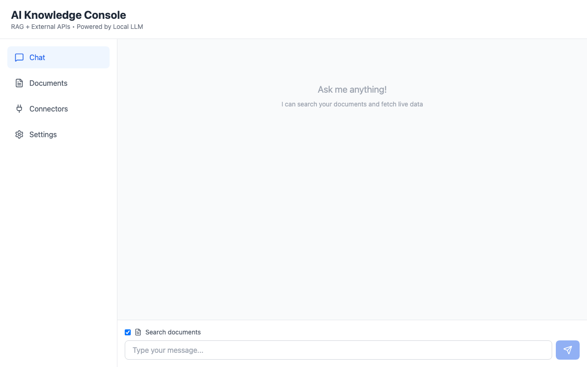

# AI Knowledge Console

[](LICENSE)


An end-to-end Retrieval-Augmented Generation (RAG) web application. Upload your documents (PDF, DOCX, TXT), index them into a vector store (ChromaDB) with `SentenceTransformers`, and chat with a local LLM (llama.cpp) enriched by relevant document context and optional external tools (GitHub, Crypto, Weather, Hacker News, Gmail, Drive, Slack, Notion).

## ⚡ Quick Start (Works Immediately)

**The core RAG functionality works out-of-the-box with no API keys required:**
- ✅ Upload documents (PDF, DOCX, TXT)
- ✅ Chat with your documents using RAG
- ✅ Conversation memory
- ✅ Streaming responses

**Optional integrations** (configure later if needed):
- 🔧 External APIs (GitHub, Weather, Crypto, Hacker News)
- 🔐 OAuth services (Gmail, Drive, Slack, Notion)

See [Configuration](#optional-enhancements) below to enable optional features.

## Why This Matters for Recruiters

**This project demonstrates production-grade AI engineering:**
- Core RAG system works immediately (no setup friction)
- Optional integrations show OAuth 2.0 implementation skills
- Clean architecture: separation of required vs optional features
- Ready to clone and run - perfect for portfolio demonstration

## Features
- Document upload: PDF, DOCX, TXT
- Chunking + ChromaDB persistent vector store
- RAG chat: REST and WebSocket streaming
- Conversation memory: tracks chat history for context-aware follow-up questions
- External tools (optional): GitHub commits, crypto prices, weather, Hacker News
- OAuth integrations (optional): Gmail, Google Drive, Slack, Notion
- Production Docker: multi-stage builds, healthchecks, non-root user
- CI/CD: GitHub Actions building and pushing Docker images to GHCR

## Quick Demo


This GIF shows: starting the stack, uploading a doc, and running chat with RAG.

## Architecture
- Backend (`/backend`): FastAPI app (`app.py`), served by Gunicorn with Uvicorn workers.
- Embeddings: `SentenceTransformer` model (`all-MiniLM-L6-v2`).
- Vector DB: ChromaDB persistent client (`/vectorstore/chroma`).
- LLM: llama.cpp server running on host at `http://localhost:8080`.
- Frontend (`/frontend`): React + Vite (built and served by Nginx).
- Docker Compose (`/docker`): Orchestrates backend and frontend, proxies `/api` through Nginx to backend.

Ports
- Frontend: `http://localhost:3000`
- Backend API: `http://localhost:8000`
- LLM (host): `http://localhost:8080`

## Tech Stack
- Backend: Python 3.11, FastAPI, Gunicorn+Uvicorn, httpx
- RAG: ChromaDB, sentence-transformers
- Frontend: React + Vite, Tailwind CSS, React Query
- Containerization: Docker, Docker Compose; Nginx production static serving
- CI/CD: GitHub Actions, GHCR (GitHub Container Registry)

## Prerequisites
- Docker Desktop (macOS/Windows) or Docker Engine (Linux)
- For macOS on Apple Silicon, Colima is supported as an alternative to Docker Desktop
- For local development (optional): Python 3.11+, Node 18+
- **LLM Server**: Choose one of the following options:
  - Local llama.cpp server (recommended for privacy)
  - OpenAI API (fastest to set up)
  - Any OpenAI-compatible API (Ollama, LocalAI, vLLM, etc.)

## LLM Setup Guide

You have several options to power the AI responses. Choose the one that fits your needs:

### Option 1: llama.cpp (Local, Private)

**Pros**: No API costs, full privacy, works offline  
**Cons**: Requires downloading models, more setup

1. **Download llama.cpp**:
   ```bash
   git clone https://github.com/ggerganov/llama.cpp
   cd llama.cpp
   make
   ```

2. **Download a model** (GGUF format):
   - Visit [HuggingFace](https://huggingface.co/models?library=gguf) to find models
   - Example: `Meta-Llama-3.1-8B-Instruct-Q4_K_M.gguf`
   - Download to your local machine

3. **Start the server**:
   ```bash
   ./server -m /path/to/model.gguf -c 4096 --port 8080 --host 0.0.0.0
   ```
   
   **Important flags**:
   - `-m`: Path to your model file
   - `-c 4096`: Context window size
   - `--port 8080`: Server port (must match backend config)
   - `--host 0.0.0.0`: Makes it accessible from Docker containers

4. **Verify it's running**:
   ```bash
   curl http://localhost:8080/health
   ```

### Option 2: OpenAI API (Fastest Setup)

**Pros**: No local resources needed, fastest responses  
**Cons**: Costs money, sends data to OpenAI

1. **Get an API key** from [OpenAI Platform](https://platform.openai.com/api-keys)

2. **Configure the backend** (`backend/.env`):
   ```env
   LLM_PROVIDER=openai
   OPENAI_API_KEY=sk-...
   ```

3. **Modify `backend/services/llm_service.py`** to use OpenAI client:
   ```python
   # Add OpenAI support (requires: pip install openai)
   from openai import OpenAI
   
   if self.settings.llm_provider == "openai":
       client = OpenAI(api_key=self.settings.openai_api_key)
       # Use client.chat.completions.create(...)
   ```

### Option 3: Ollama (Easy Local Setup)

**Pros**: Simpler than llama.cpp, automatic model management  
**Cons**: Still requires local resources

1. **Install Ollama**:
   ```bash
   # macOS
   brew install ollama
   
   # Linux
   curl -fsSL https://ollama.com/install.sh | sh
   ```

2. **Pull a model**:
   ```bash
   ollama pull llama3.1:8b
   ```

3. **Start Ollama** (it runs on port 11434 by default):
   ```bash
   ollama serve
   ```

4. **Configure backend** (`backend/.env`):
   ```env
   LLM_PROVIDER=local
   LLM_BASE_URL=http://localhost:11434/v1
   ```
   Ollama provides an OpenAI-compatible endpoint at `/v1`.

## Quickstart: Docker (macOS/Windows)
1. Start Docker Desktop
2. From the project root:
```bash
cd docker
docker compose up --build -d
```
3. Open `http://localhost:3000`

The frontend talks to backend at `http://backend:8000` via Nginx, and backend reaches the host LLM using `http://host.docker.internal:8080`.

## Quickstart: Docker (Linux)
- `host.docker.internal` is not always available by default. This compose file sets:
```yaml
extra_hosts:
  - "host.docker.internal:host-gateway"
```
so the backend can reach the host LLM at `http://host.docker.internal:8080`.
Run:
```bash
cd docker
docker compose up --build -d
```

## Quickstart: Colima (macOS, Apple Silicon)
```bash
brew install colima
colima start
export DOCKER_HOST=unix://$HOME/.colima/default/docker.sock
cd docker
docker compose up --build -d
```

## Usage
1. Start the LLM server on host at port 8080.
2. Start the app (Docker or local dev).
3. Upload documents via the UI; the backend extracts text, chunks and indexes into ChromaDB.
4. Chat:
   - Toggle "Use documents" to enable RAG.
   - **(Optional)** Enable external tools (`github`, `crypto`, `weather`, `hackernews`) and provide params.
   - **(Optional)** Authorize OAuth services (`gmail`, `drive`, `slack`, `notion`) via Connectors tab, then enable them.
   - Streaming responses are available via WebSocket.
   - Click "New Chat" to start a fresh conversation; the system maintains history within a conversation for context-aware responses.

## Configuration

### Required: LLM Setup

The app requires an LLM server. Choose one option from the [LLM Setup Guide](#llm-setup-guide) above.

**Minimum `.env` for core functionality:**
```env
LLM_PROVIDER=local
LLM_BASE_URL=http://localhost:8080
```

### Optional Enhancements

The following features are **entirely optional**. The app works perfectly without them.

#### Simple API Tools (No OAuth)

Add API keys to enable these tools:

```env
# GitHub: Search repository commits
GITHUB_TOKEN=your_github_token

# Weather: Current conditions
OPENWEATHER_API_KEY=your_api_key
```

**How to get**:
- GitHub: [Personal Access Token](https://github.com/settings/tokens)
- Weather: [OpenWeather API](https://openweathermap.org/api)

#### Advanced OAuth Integrations

**Gmail, Google Drive, Slack, Notion** require OAuth 2.0 setup.

**Quick summary**:
1. Create OAuth app in each provider (Google Cloud, Slack, Notion)
2. Add credentials to `.env`:
   ```env
   GOOGLE_CLIENT_ID=...
   GOOGLE_CLIENT_SECRET=...
   SLACK_CLIENT_ID=...
   SLACK_CLIENT_SECRET=...
   NOTION_CLIENT_ID=...
   NOTION_CLIENT_SECRET=...
   ```
3. You can then authorize your accounts through the UI

### Full .env Example

```env
# Required
LLM_PROVIDER=local
LLM_BASE_URL=http://localhost:8080
CHROMA_PERSIST_DIR=../vectorstore/chroma

# Optional: Simple API Tools
GITHUB_TOKEN=
OPENWEATHER_API_KEY=

# Optional: OAuth Integrations
APP_BASE_URL=http://localhost:8000
GOOGLE_CLIENT_ID=
GOOGLE_CLIENT_SECRET=
SLACK_CLIENT_ID=
SLACK_CLIENT_SECRET=
NOTION_CLIENT_ID=
NOTION_CLIENT_SECRET=
```

Copy from example:
```bash
cp backend/.env.example backend/.env
# Edit backend/.env with your credentials (only if you want optional features)
```

## Local Development (without Docker)

Backend
```bash
cd backend
python3 -m venv .venv && source .venv/bin/activate
python -m pip install --upgrade pip
python -m pip install -r requirements.txt
uvicorn app:app --reload --port 8000
```

Frontend
```bash
cd frontend
npm ci
npm run dev
```
Default dev ports: frontend (5173), backend (8000). CORS allows `http://localhost:5173` and `http://localhost:3000`.

## API Overview
- Documents
  - `POST /api/documents/upload` — Upload and index a document
  - `GET  /api/documents/list` — List indexed documents
  - `DELETE /api/documents/{filename}` — Delete indexed chunks for a document
- Chat
  - `POST /api/chat/query` — Non-streaming chat; accepts `{ message, use_documents, tools, tool_params }`
  - `WS   /api/chat/ws` — Streaming chat over WebSocket
  - `POST /api/chat/conversations` — Create a new conversation
  - `GET  /api/chat/conversations/{conversation_id}` — Retrieve conversation history
- Connectors
  - `GET  /api/connectors/` — List available connectors and their status
  - `POST /api/connectors/configure` — Configure a connector with API key
  - `POST /api/connectors/{name}/toggle` — Enable/disable a connector
- Health
  - `GET  /health` — Health probe used by Compose

## Deploy from GHCR
Use the prebuilt images:
```bash
cd deploy
docker compose -f docker-compose.ghcr.yml up -d
```
The compose file pulls:
- `ghcr.io/firechair/ai-knowledge-console/backend:latest`
- `ghcr.io/firechair/ai-knowledge-console/frontend:latest`

## Demo Options
- Build locally and run:
  - `cd docker && docker compose up -d`
  - Frontend: `http://127.0.0.1:3000`, Backend API: `http://127.0.0.1:8000`
- Pull prebuilt images from GHCR (requires public images or `docker login ghcr.io`):
  - `cd deploy && docker compose -f docker-compose.ghcr.yml up -d`
  - Frontend: `http://localhost:3000`, Backend proxied via Nginx
- Traefik local proxy with GHCR images (HTTP only):
  - `cd deploy/traefik && docker compose -f docker-compose.local.yml up -d`
  - App: `http://localhost`, API: `http://localhost/api`
- Traefik local proxy using locally built images (no registry):
  - Build local images via `docker/docker-compose.yml`
  - `cd deploy/traefik && docker compose -f docker-compose.local-built.yml up -d`
  - App: `http://localhost`, API: `http://localhost/api`

## TLS with Traefik
Requirements:
- DNS A/AAAA record for your domain pointing to the server
- `TRAEFIK_EMAIL` and `TRAEFIK_DOMAIN` set

Steps:
```bash
cd deploy/traefik
mkdir -p acme && touch acme/acme.json && chmod 600 acme/acme.json
TRAEFIK_EMAIL=you@example.com TRAEFIK_DOMAIN=console.example.com \
  docker compose -f docker-compose.traefik.yml up -d
```
Routes:
- `https://<domain>/` → frontend (Nginx)
- `https://<domain>/api/...` → backend (FastAPI)
HTTP is redirected to HTTPS automatically.

## Local Reverse Proxy (Traefik)
Run the stack locally with Traefik (HTTP only):
```bash
cd deploy/traefik
docker compose -f docker-compose.local.yml up -d
```
Routes:
- `http://localhost/` → frontend (Nginx)
- `http://localhost/api/...` → backend (FastAPI)

## CI/CD
- GitHub Actions are included:
  - CI (`.github/workflows/ci.yml`):
    - Backend: Python 3.11; install `backend/requirements.txt`; sanity import checks; compile sources
    - Frontend: Node 18; `npm ci`; `npm run build` (Vite production build)
  - CD (`.github/workflows/docker.yml`):
    - On push to `main`: build and push Docker images to GHCR
    - Image tags:
      - `ghcr.io/firechair/ai-knowledge-console/backend:latest`
      - `ghcr.io/firechair/ai-knowledge-console/frontend:latest`
    - Uses built-in `GITHUB_TOKEN` with `packages: write` permission

This ensures every change is built and validated automatically; main branch produces ready-to-run images.

## Configuration Guide
Backend (`backend/.env`):
- `LLM_PROVIDER` — e.g. `local`
- `LLM_BASE_URL` — e.g. `http://localhost:8080`
- `CHROMA_PERSIST_DIR` — vectorstore path
- `GITHUB_TOKEN` — GitHub API token (optional)
- `OPENWEATHER_API_KEY` — OpenWeather token (optional)
- `allowed_origins` — comma-separated origins for CORS
- `max_upload_mb` — upload size limit
- `rate_limit_enabled`, `rate_limit_requests`, `rate_limit_window_sec`

Frontend:
- `VITE_API_URL` — defaults to `/api` via Nginx proxy; override if needed

Docker Compose:
- `env_file` — backend reads `../backend/.env`
- `volumes` — mount persistent storage for vectorstore/uploads
- `extra_hosts` — Linux `host-gateway` to reach host LLM

Traefik:
- Local demo: use `docker-compose.local.yml` (HTTP only)
- Production: use the TLS compose with `TRAEFIK_EMAIL` and `TRAEFIK_DOMAIN`

## Troubleshooting
- Docker daemon not running: start Docker Desktop (macOS/Windows) or ensure Docker Engine service is active (Linux).
- Linux LLM connectivity: use `host-gateway` mapping (already set). Confirm host LLM is listening on `:8080`.
- HuggingFace hub compatibility: repo pins `huggingface_hub==0.25.2` to match `sentence-transformers==2.2.2`.
- SSL warnings (`urllib3`): cosmetic on macOS LibreSSL, does not affect local development.

LLM startup checks:
- `curl http://localhost:8080/completion` should return an error or a JSON structure (server reachable)
- Increase timeouts if responses are large or model is slow

Proxy/WebSockets:
- Traefik config includes upgrade headers; if self-hosting a different proxy, ensure `Upgrade` and `Connection` headers pass through

## Single-VM Deployment
Minimum specs:
- 4 vCPU, 8 GB RAM (more for larger models)
- Persistent storage for `vectorstore` and uploads

Run as a service:
```bash
cd deploy
docker compose -f docker-compose.ghcr.yml up -d
```

Systemd example:
```ini
[Unit]
Description=AI Knowledge Console
After=network.target docker.service
Requires=docker.service

[Service]
WorkingDirectory=/opt/ai-knowledge-console/deploy
Environment=LLM_BASE_URL=http://localhost:8080
ExecStart=/usr/bin/docker compose -f docker-compose.ghcr.yml up -d
ExecStop=/usr/bin/docker compose -f docker-compose.ghcr.yml down
Restart=always

[Install]
WantedBy=multi-user.target
```
