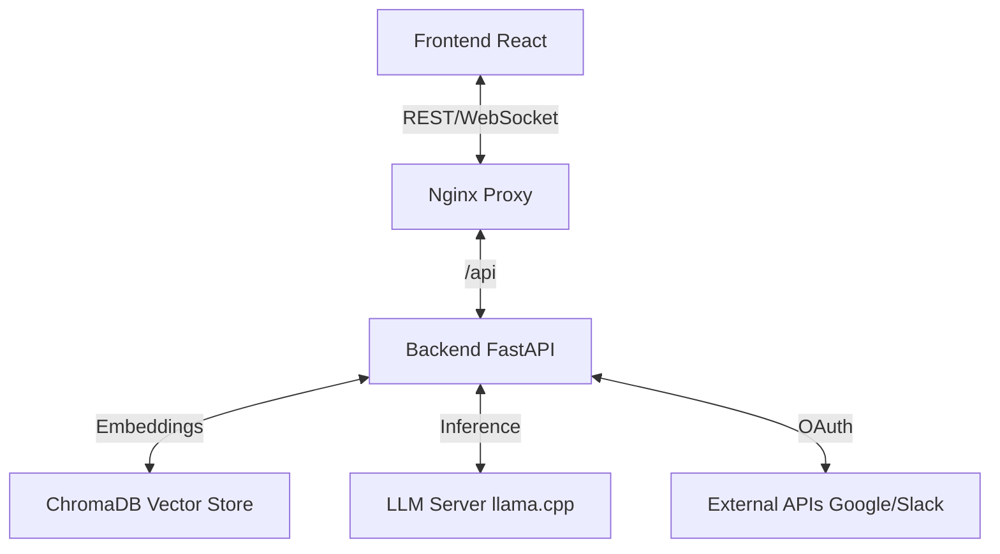

# System Architecture

This document provides a comprehensive technical overview of the AI Knowledge Console's architecture, design decisions, and implementation details.

## Table of Contents
- [Overview](#overview)
- [Backend Architecture](#backend-architecture)
- [Frontend Architecture](#frontend-architecture)
- [Configuration & Data Flow](#configuration--data-flow)
- [Docker Optimization](#docker-optimization)
- [Design Patterns](#design-patterns)

---

## Overview

The AI Knowledge Console follows a **microservices-lite** architecture, containerized with Docker for consistency across environments.



### Components

| Component | Technology | Purpose |
|-----------|------------|---------|
| **Frontend** | React + Vite | User interface for chat and document management |
| **Backend** | FastAPI (Python) | API orchestration, RAG logic, and tool integration |
| **Vector DB** | ChromaDB | Stores document embeddings for semantic search |
| **Proxy** | Nginx | Reverse proxy to serve frontend and route API requests |
| **LLM** | llama.cpp / Cloud | Local or cloud LLM inference (OpenAI compatible) |

---

## Backend Architecture

### Application Structure

**Framework:** FastAPI (`backend/app.py`)

```
backend/
├── app.py                    # Main FastAPI application
├── routers/                  # API endpoints (mounted under /api/*)
│   ├── documents.py         # Document upload, list, delete
│   ├── chat.py              # Query and WebSocket streaming
│   ├── conversations.py     # Conversation CRUD operations
│   ├── files.py             # File generation (PDF, HTML, Markdown)
│   ├── models.py            # Model download and management
│   ├── api_keys.py          # API key CRUD operations
│   ├── settings.py          # Settings management
│   ├── connectors.py        # External tool configuration
│   └── auth.py              # OAuth flows (Google, Slack, Notion)
├── services/                # Business logic layer
│   ├── llm_service.py       # Multi-provider LLM abstraction
│   ├── vector_store.py      # ChromaDB wrapper
│   ├── file_service.py      # PDF/HTML/Markdown generation
│   ├── config_service.py    # Settings.json management
│   ├── model_manager.py     # Model download and caching
│   ├── provider_registry.py # Cloud provider definitions
│   ├── conversation_service.py # SQLite conversation storage
│   └── api_tools.py         # External API integrations
├── schemas/                 # Pydantic models
│   └── llm_config.py        # LLM configuration schemas
├── middleware/              # Error handling, logging, rate limiting
└── config.py                # Environment configuration
```

### Application Startup

**Lifespan Management** (`backend/app.py:21`)

```python
@asynccontextmanager
async def lifespan(app: FastAPI):
    # Initialize logging (backend/app.py:24)
    setup_logging()

    # Lazy-load vector store (backend/app.py:28)
    VectorStoreService()

    yield
    # Cleanup (if needed)
```

### Routers

| Router | Endpoints | Purpose |
|--------|-----------|---------|
| **Documents** | `/api/documents/*` | Upload, list, delete indexed documents |
| **Chat** | `/api/chat/*` | Sync/stream query endpoints |
| **Conversations** | `/api/conversations/*` | Full CRUD for conversation history |
| **Files** | `/api/files/*` | Generate and download files (`backend/routers/files.py:8`) |
| **Models** | `/api/models/*` | Download and list LLM/embedding models |
| **API Keys** | `/api/api-keys/*` | Manage service credentials |
| **Settings** | `/api/settings` | Get and update configuration |
| **Connectors** | `/api/connectors/*` | OAuth integration management |
| **Auth** | `/api/auth/*` | OAuth authorization flows |

### Services Deep Dive

#### LLMService (`backend/services/llm_service.py`)

**Purpose:** Multi-provider LLM abstraction layer

**Capabilities:**
- **Local Provider:** llama.cpp at localhost:8080 (OpenAI-compatible)
- **OpenRouter:** 200+ models via unified API
- **OpenAI:** Direct GPT-4, GPT-3.5 access
- **Custom:** Any OpenAI-compatible endpoint (Ollama, LM Studio)

**Key Features:**
- Streaming and non-streaming responses
- Provider detection with env override support
- RAG prompt building with conversation history
- File artifact generation via special XML tags

**Provider Selection Logic:**
1. Env `llm_provider=local` enforces local (`backend/services/llm_service.py:68`, `:75`)
2. OpenRouter recognized via env or merged config (`backend/services/llm_service.py:49`)
3. ConfigService merges settings.json with environment variables

#### VectorStoreService (`backend/services/vector_store.py`)

**Purpose:** ChromaDB wrapper for document embeddings

**Features:**
- Lazy-loads SentenceTransformer embedding model (all-MiniLM-L6-v2)
- Persistent storage at `vectorstore/chroma`
- Cosine similarity search
- **Granular document filtering** by filename
- Metadata tracking (filename, page info)

**Key Method:** `search(query, n_results=5, file_filters=None)`

#### FileService (`backend/services/file_service.py`)

**Purpose:** Multi-format file generation

**Features:**
- Generate PDF, HTML, Markdown from content
- Store in `static/generated/` directory
- **Absolute URL generation** for Docker compatibility (`backend/services/file_service.py:44`, `:60`, `:111`)
- Unique filename handling

**Why Absolute URLs?**
- Vite proxy only covers `/api`, not `/static`
- Prevents frontend proxy issues in development
- Ensures compatibility across Docker and local setups

#### ConfigService (`backend/services/config_service.py`)

**Purpose:** Settings.json management and configuration merging

**Features:**
- Manages user settings via `settings.json`
- Auto-migrates legacy settings format
- Merges with environment variables (env takes precedence)
- Stores API keys securely

**Configuration Precedence:**
1. **Application Defaults** - Hardcoded fallback values
2. **settings.json** - User preferences from UI
3. **Environment Variables (.env)** - Highest priority

#### ModelManager (`backend/services/model_manager.py`)

**Purpose:** Download and manage LLM/embedding models

**Features:**
- Download GGUF models from HuggingFace
- Manage SentenceTransformer embedding models
- Track download progress with status endpoints
- Background download tasks

#### ProviderRegistry (`backend/services/provider_registry.py`)

**Purpose:** Cloud provider definitions and configuration

**Providers:**
- **OpenRouter:** Unified access to 200+ models
- **OpenAI:** Direct GPT-4, GPT-3.5 access
- **Custom:** User-defined OpenAI-compatible endpoints

#### ConversationService (`backend/services/conversation_service.py`)

**Purpose:** SQLite-backed conversation storage

**Features:**
- Multi-turn conversation history
- Search and list functionality
- Metadata: created_at, title, message count
- Safe schema migrations

#### APIToolsService (`backend/services/api_tools.py`)

**Purpose:** External data source integrations

**Integrations:**
- **GitHub:** Search commits by repo
- **Crypto:** Real-time prices (CoinGecko, no API key needed)
- **Weather:** Current conditions (OpenWeather API)
- **Hacker News:** Top stories (no API key needed)
- **Gmail, Drive, Slack, Notion:** OAuth-authenticated searches

**Pattern:** Async/await for concurrent requests

### Middleware & Logging

**Access Logging** (`backend/app.py:60`)
- Request ID tracking
- Duration measurement
- Structured logging format

**Rate Limiting** (`backend/app.py:65`)
- Optional in-memory limiter
- Configurable requests per window
- Rate limit headers on responses (`backend/app.py:95`)

**Error Handling** (`backend/middleware/error_handler.py`)
- Custom exception handlers
- Consistent error response format
- Request ID in error responses

### Static Files

**Mount Point:** `/static` (`backend/app.py:127`)

**Generated Content:** `static/generated/`
- PDF exports
- HTML exports
- Markdown exports

---

## Frontend Architecture

### Technology Stack

- **Framework:** React 18 with Vite
- **Styling:** Tailwind CSS
- **UI Components:** Radix UI (Popovers, Dialogs)
- **State Management:** React Query
- **Routing:** React Router
- **Communication:** REST API + WebSocket streaming

### Component Organization

```
frontend/src/
├── components/
│   ├── layout/              # Application shell
│   │   ├── AppShell.jsx    # Main layout wrapper
│   │   ├── Header.jsx      # Top navigation
│   │   └── Sidebar.jsx     # Side navigation
│   ├── settings/            # Settings management
│   │   ├── LLMProviderSelector.jsx
│   │   ├── CloudProviderSelector.jsx
│   │   ├── ProviderTypeSelector.jsx
│   │   ├── LocalProviderConfig.jsx
│   │   ├── OpenRouterConfig.jsx
│   │   ├── OpenAIConfig.jsx
│   │   ├── CustomProviderConfig.jsx
│   │   ├── APIKeysManager.jsx
│   │   └── ModelManager.jsx
│   └── ui/                  # Reusable UI components
│       ├── Button.jsx
│       ├── Input.jsx
│       ├── Card.jsx
│       ├── Popover.jsx
│       ├── ChatMessage.jsx
│       └── FileDownloadCard.jsx
├── pages/                   # Main application views
│   ├── ChatPage.jsx        # Chat interface with WebSocket
│   ├── DocumentsPage.jsx   # Document upload and management
│   ├── ConversationsPage.jsx # Conversation history
│   ├── ConnectorsPage.jsx  # OAuth integration setup
│   └── SettingsPage.jsx    # Settings panel (tabbed interface)
├── hooks/                   # Custom React hooks
│   ├── useAPIKeys.js       # API key management
│   ├── useCloudProviders.js # Cloud provider data
│   └── useTheme.js         # Theme management
└── utils/
    └── cn.js               # Class name utility
```

### Key Pages

#### ChatPage (`/chat`)
- Real-time chat interface with WebSocket streaming
- Settings popover for:
  - Document selection (granular context control)
  - Tool selection and parameters
- Message history display
- File download support

#### ConversationsPage (`/conversations`)
- List all conversations with metadata
- Rename, delete, bulk delete operations
- Search functionality
- Responsive design (desktop/mobile)

#### DocumentsPage (`/documents`)
- Upload documents with drag-drop support
- List indexed documents with metadata
- Delete individual documents

#### ConnectorsPage (`/connectors`)
- OAuth setup for Gmail, Drive, Slack, Notion
- Configuration status for each connector
- Enable/disable toggles

#### SettingsPage (`/settings`)
- Tabbed interface:
  - **LLM Provider:** Switch between local/cloud, select models
  - **API Keys:** Manage secrets for optional services
  - **Model Management:** Download and cache models

### State Management

**React Query** for server state:
- Automatic caching
- Background refetching
- Optimistic updates
- Error handling

**Local State:** useState, useContext for UI state

### WebSocket Implementation

**Resilient WebSocket Lifecycle:**
- **Problem:** React Strict Mode (dev) mounts effects twice, causing duplicated tokens or premature socket closes
- **Solution:**
  - Single connection with connection guard
  - Reconnects only when necessary
  - Proper handler cleanup
  - Text normalization to collapse duplicate words

**OpenRouter Streaming (SSE):**
- Backend streams Server-Sent Events from OpenRouter
- Forwards deltas over WebSocket to frontend
- Client concatenates and normalizes output

---

## Configuration & Data Flow

### Configuration Precedence

**Loading Order** (later sources override earlier):

1. **Application Defaults** - Hardcoded fallback values in code
2. **settings.json** - User preferences from UI (managed by ConfigService)
3. **Environment Variables (.env)** - Highest priority

**Example:** If `LLM_PROVIDER=local` in `.env`, it overrides any cloud provider selection in `settings.json`.

**Config Service Integration:**
- Env-driven settings from `config.py` override where tests expect it
- User `settings.json` merged by ConfigService when present
- LLMService chooses provider and base URL based on merged config

### Data Flow Diagrams

#### RAG Pipeline

```
User Upload → Text Extraction → Chunking → Embedding → Vector Store
                                                              ↓
User Query → Embedding → Vector Search → Retrieve Chunks → LLM Context
                                                              ↓
                                                  LLM Generation → Response
```

**Detailed Steps:**
1. **Ingestion:** Documents chunked (recursive character splitter) and embedded
2. **Storage:** Chunks stored in ChromaDB with metadata
3. **Retrieval:** User query embedded → Vector search finds top-k relevant chunks
4. **Augmentation:** Chunks formatted into prompt context
5. **Generation:** LLM generates answer based on provided context

#### Chat Flow

```
User Input → Context Retrieval (if documents selected) → LLM Service
                                                              ↓
                                              Streaming/Non-streaming Response
                                                              ↓
                                              WebSocket → Frontend UI
```

#### File Generation Flow

```
Frontend: POST /api/files/generate
    {content, format, title, filename}
              ↓
Router: /api/files/generate (backend/routers/files.py:17)
              ↓
FileService.generate_file (backend/routers/files.py:28)
              ↓
Write to static/generated/ + Return absolute URL
    (backend/services/file_service.py:44, :60, :111)
              ↓
Frontend: Trigger download using returned URL
```

---

## Docker Optimization

### The "CPU-First" Decision

A critical design choice was made to optimize Docker images for **CPU inference**.

#### The Problem: PyTorch Bloat

By default, installing `sentence-transformers` or `torch` pulls the **CUDA-enabled version** of PyTorch.

- **Size:** ~2.5 GB (includes massive NVIDIA driver binaries)
- **Impact:** Slow builds, huge images, CI/CD timeouts
- **Relevance:** Most users run on laptops (Mac M1/M2, Intel) or standard cloud VMs without GPUs

#### The Solution: Explicit CPU Builds

We explicitly target the CPU-only wheels in our `Dockerfile`:

```dockerfile
# Install CPU-only torch to save ~2GB of space
RUN pip install --no-cache-dir torch --index-url https://download.pytorch.org/whl/cpu
```

**Benefits:**
- **Image Size:** Reduced by ~2GB
- **Build Speed:** CI builds complete in minutes instead of timing out
- **Compatibility:** Runs natively on any x86_64 or ARM64 (Apple Silicon) machine

### GPU Enablement Guide

If you **do** have a dedicated NVIDIA GPU and want to accelerate embedding generation:

#### Prerequisites
- NVIDIA GPU with updated drivers
- [NVIDIA Container Toolkit](https://docs.nvidia.com/datacenter/cloud-native/container-toolkit/install-guide.html) installed on host

#### How to Enable GPU Support

1. **Modify `docker/backend.Dockerfile`:**

   Remove the CPU-only installation line:

   ```dockerfile
   # REMOVE THIS LINE:
   # RUN pip install --no-cache-dir torch --index-url https://download.pytorch.org/whl/cpu

   # The standard requirements.txt install will now pull the CUDA version automatically
   RUN pip install -r requirements.txt
   ```

2. **Update `docker-compose.yml`:**

   Add the `deploy` section to pass the GPU through:

   ```yaml
   services:
     backend:
       # ... other config ...
       deploy:
         resources:
           reservations:
             devices:
               - driver: nvidia
                 count: 1
                 capabilities: [gpu]
   ```

3. **Rebuild:**

   ```bash
   docker compose build backend
   docker compose up -d
   ```

### Multi-Stage Builds

**Strategy:** Separate build and runtime stages to minimize final image size

**Backend Dockerfile:**
- Build stage: Install dependencies
- Runtime stage: Copy only necessary files

**Frontend Dockerfile:**
- Build stage: npm install + vite build
- Runtime stage: Nginx serving static dist/

---

## Design Patterns

### Dependency Injection

**FastAPI's Built-in DI:**
- Services initialized at startup (lifespan)
- Injected into route handlers via `Depends()`
- Singleton pattern for vector store, conversation service

**Example:**
```python
@router.post("/documents/upload")
async def upload_document(
    file: UploadFile,
    vector_store: VectorStoreService = Depends(get_vector_store)
):
    # vector_store injected automatically
    pass
```

### Service Layer Abstraction

**Pattern:** Separate business logic from HTTP concerns

- **Routers:** Handle HTTP requests, validation, responses
- **Services:** Implement core business logic
- **Benefits:** Easier testing, cleaner code, reusable logic

### OAuth Token Management

**Implementation:** `backend/services/oauth_tokens.py`

**Provider-Specific Routes:** `backend/routers/auth.py` (Google, Slack, Notion)

**Storage:** In-memory for development (swap to persistent in production)

**Flow:**
1. User initiates OAuth flow from Connectors page
2. Backend redirects to provider's authorization URL
3. Provider redirects back with authorization code
4. Backend exchanges code for access token
5. Token stored and used for API calls

### WebSocket Lifecycle Management

**Challenge:** React Strict Mode causes double-mounting in development

**Solution:**
- Connection guard prevents multiple simultaneous connections
- Cleanup only closes `OPEN` sockets
- Text normalization collapses duplicate tokens

**Implementation Highlights:**
- Single WebSocket connection per chat session
- Reconnection logic with exponential backoff
- Proper cleanup on unmount

### Lazy Loading

**Embedding Model Lazy Initialization:**
- **Why:** Faster app startup (model ~90MB)
- **How:** Model loads on first use (first document add or search)
- **Benefit:** App responds quickly without waiting for model download

### Multi-Provider Abstraction

**Pattern:** Single interface, multiple implementations

**LLMService abstracts:**
- Local (llama.cpp)
- OpenRouter (SSE streaming)
- OpenAI (native API)
- Custom (user-defined endpoints)

**Benefits:**
- Switch providers at runtime
- Consistent interface for all routers
- Easy to add new providers

---

## Database & Persistence

### ChromaDB (Vector Store)

**Type:** Embedded vector database

**Location:** `vectorstore/chroma`

**Features:**
- Persistent collections
- Cosine similarity search
- Metadata filtering
- Automatic embedding via SentenceTransformers

**Schema:**
- **Documents:** Text chunks from uploaded files
- **Embeddings:** 384-dimensional vectors (all-MiniLM-L6-v2)
- **Metadata:** filename, page number, chunk index

### SQLite (Conversations)

**Location:** `backend/conversations.db`

**Schema:**
```sql
CREATE TABLE conversations (
    id TEXT PRIMARY KEY,
    created_at DATETIME,
    title TEXT,
    messages TEXT -- JSON array
);
```

**Migrations:** Automatic (title column added in v1.0)

### Settings.json (User Preferences)

**Location:** `backend/settings.json`

**Format:** JSON

**Managed By:** ConfigService

**Example:**
```json
{
  "llm": {
    "provider_type": "cloud",
    "cloud_provider": "openrouter",
    "model": "x-ai/grok-4.1-fast",
    "temperature": 0.7
  },
  "api_keys": {
    "openrouter": "sk-or-v1-..."
  }
}
```

---

## Security Considerations

### CORS Configuration

**Allowed Origins:** Configured via env `allowed_origins`

**Default:** `http://localhost:5173`, `http://localhost:3000`

**Production:** Set to your domain only

### Rate Limiting

**Implementation:** In-memory rate limiter (optional)

**Configuration:**
- `rate_limit_enabled` (default: false)
- `rate_limit_requests` (default: 100)
- `rate_limit_window_sec` (default: 60)

**Headers:** `X-RateLimit-Limit`, `X-RateLimit-Remaining`, `X-RateLimit-Reset`

### API Key Storage

**Development:** settings.json (file-based, .gitignored)

**Production Recommendation:** Use environment variables or secret management service

### OAuth Security

- State parameter validation
- HTTPS required in production
- Token refresh handling
- Scope limitation (request only needed permissions)

---

## Performance Optimizations

### Lazy Loading
- Embedding model loads on first use
- Vector store initializes on demand

### Streaming Responses
- WebSocket streaming for real-time feedback
- SSE for OpenRouter streaming
- Reduces perceived latency

### Caching
- React Query caches API responses
- LocalStorage for chat history
- Embedding model cached in memory

### Async/Await
- Non-blocking I/O for external API calls
- Concurrent tool execution
- FastAPI's async support

---

## Deployment Architecture

### Docker Compose Orchestration

```yaml
services:
  frontend:  # Nginx serving React build
  backend:   # FastAPI + Gunicorn + Uvicorn workers
  # LLM runs on host (not containerized)
```

### Traefik Integration

**Features:**
- Automatic TLS with Let's Encrypt
- HTTP to HTTPS redirect
- Reverse proxy routing

**Routes:**
- `https://<domain>/` → frontend
- `https://<domain>/api/` → backend

### Health Checks

**Endpoint:** `GET /health`

**Response:** `{"status": "healthy"}`

**Docker:** Health check configured in docker-compose.yml

---

## Monitoring & Observability

### Structured Logging

**Format:** JSON logs with structured fields

**Fields:**
- `timestamp`
- `level` (INFO, WARNING, ERROR)
- `request_id`
- `duration` (for requests)
- `message`

### Request ID Tracking

**Implementation:** Middleware adds `X-Request-ID` header

**Purpose:** Trace requests across services and logs

### Error Tracking

- Custom exception handlers
- Consistent error response format
- Error logging with context

---

## Summary

The AI Knowledge Console demonstrates production-grade architecture with:

- **Clean Separation:** Backend (FastAPI), Frontend (React), Vector DB (ChromaDB), LLM (external)
- **Modularity:** Service layer abstraction, dependency injection, multi-provider support
- **Performance:** Lazy loading, streaming, async/await, CPU-optimized Docker images
- **Security:** CORS, rate limiting, OAuth 2.0, API key management
- **Deployment:** Docker Compose, Traefik, health checks, systemd support
- **Developer Experience:** Comprehensive testing, structured logging, clear code organization

This architecture supports rapid feature development while maintaining production-ready quality and performance.
