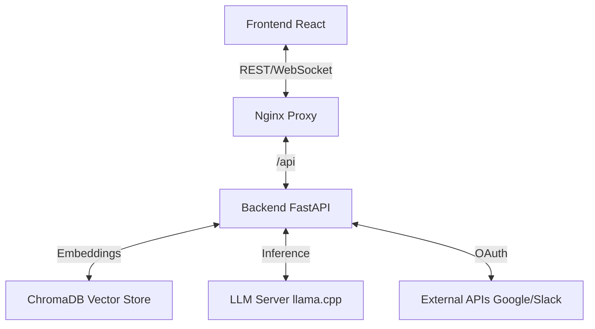

# System Architecture & Design Decisions

This document details the technical architecture, design choices, and optimization strategies used in the AI Knowledge Console.

## 1. High-Level Architecture

The application follows a **microservices-lite** architecture, containerized with Docker for consistency across environments.



### Components

| Component | Technology | Purpose |
|-----------|------------|---------|
| **Frontend** | React + Vite | User interface for chat and document management. |
| **Backend** | FastAPI (Python) | API orchestration, RAG logic, and tool integration. |
| **Vector DB** | ChromaDB | Stores document embeddings for semantic search. |
| **Proxy** | Nginx | Reverse proxy to serve frontend and route API requests. |
| **LLM** | llama.cpp | Local LLM inference server (OpenAI compatible). |

---

## 2. Docker Optimization Strategy

### The "CPU-First" Decision

A critical design choice was made to optimize the Docker images for **CPU inference**.

#### The Problem: PyTorch Bloat
By default, installing `sentence-transformers` or `torch` pulls the **CUDA-enabled version** of PyTorch.
- **Size**: ~2.5 GB (includes massive NVIDIA driver binaries)
- **Impact**: Slow builds, huge images, CI/CD timeouts.
- **Relevance**: Most users run this app on laptops (Mac M1/M2, Intel) or standard cloud VMs without dedicated GPUs.

#### The Solution: Explicit CPU Builds
We explicitly target the CPU-only wheels in our `Dockerfile`:

```dockerfile
# Install CPU-only torch to save ~2GB of space
RUN pip install --no-cache-dir torch --index-url https://download.pytorch.org/whl/cpu
```

**Benefits:**
- **Image Size**: Reduced by ~2GB.
- **Build Speed**: CI builds complete in minutes instead of timing out.
- **Compatibility**: Runs natively on any x86_64 or ARM64 (Apple Silicon) machine.

---

## 3. GPU Enablement Guide

If you **do** have a dedicated NVIDIA GPU and want to accelerate embedding generation, you can build a GPU-enabled version.

### Prerequisites
- NVIDIA GPU with updated drivers
- [NVIDIA Container Toolkit](https://docs.nvidia.com/datacenter/cloud-native/container-toolkit/install-guide.html) installed on host

### How to Enable GPU Support

1. **Modify `docker/backend.Dockerfile`**:
   Remove the CPU-only installation line.

   ```dockerfile
   # REMOVE THIS LINE:
   # RUN pip install --no-cache-dir torch --index-url https://download.pytorch.org/whl/cpu
   
   # The standard requirements.txt install will now pull the CUDA version automatically
   RUN pip install -r requirements.txt
   ```

2. **Update `docker-compose.yml`**:
   Add the `deploy` section to the backend service to pass the GPU through.

   ```yaml
   services:
     backend:
       # ... other config ...
       deploy:
         resources:
           reservations:
             devices:
               - driver: nvidia
                 count: 1
                 capabilities: [gpu]
   ```

3. **Rebuild**:
   ```bash
   docker compose build backend
   docker compose up -d
   ```

---

## 4. Design Patterns

### Factory Pattern (OAuth)
Used in `backend/services/auth/oauth_manager.py` to handle multiple OAuth providers (Google, Slack, Notion) with a unified interface. This makes adding new providers easy without changing the core logic.

### RAG Pipeline
1. **Ingestion**: Documents are chunked (recursive character splitter) and embedded.
2. **Retrieval**: User query is embedded -> Vector search finds top-k relevant chunks.
3. **Augmentation**: Chunks are formatted into a prompt context.
4. **Generation**: LLM generates answer based *only* on the provided context.

### WebSocket Streaming
Chat responses are streamed via WebSockets (`/api/chat/ws`) to provide a real-time "typing" effect, improving perceived latency for the user.

---

## 5. Frontend Architecture

### Component Structure

| Component | Purpose | Key Features |
|-----------|---------|-------------|
| **App.jsx** | Main application shell | Tab navigation, keyboard shortcuts (Cmd+1-4) |
| **Chat.jsx** | Chat interface | WebSocket streaming, message display, input handling |
| **DocumentUpload.jsx** | Document upload UI | File preview before upload, drag-and-drop support |
| **Connectors.jsx** | API/OAuth management | Tool configuration, OAuth authorization flow |
| **Settings.jsx** | App configuration | User preferences, system settings |
| **ConversationList.jsx** | Conversation browser | Search, browse, auto-refresh conversation history |
| **ErrorBoundary.jsx** | Error protection | Catches React errors, prevents white screen crashes |

### State Management
- **React Query** (`@tanstack/react-query`): Server state, caching, auto-refresh
- **Local State** (`useState`): UI state, form inputs, temporary data
- **WebSocket State**: Connection status, reconnection logic with exponential backoff

### Constants & Configuration
All magic numbers and configuration values are centralized in `frontend/src/constants.js`:
- API/WebSocket URLs
- File upload limits
- UI timing constants
- Keyboard shortcuts
- Error messages
- Theme colors

### Accessibility Features
- **WCAG 2.1 Compliance**: ARIA labels, roles, and live regions
- **Keyboard Navigation**: Full keyboard support with visual focus indicators
- **Screen Reader Support**: Semantic HTML and proper ARIA annotations
- **Keyboard Shortcuts**: 
  - `Cmd/Ctrl + 1-4`: Tab navigation
  - `Escape`: Clear selections

---

## 6. Backend Architecture

### Service Layer

| Service | File | Responsibility |
|---------|------|----------------|
| **LLMService** | `services/llm_service.py` | LLM communication (OpenRouter/llama.cpp) |
| **VectorStoreService** | `services/vector_store.py` | ChromaDB embedding and search operations |
| **ConversationService** | `services/conversation_service.py` | SQLite conversation history management |
| **APIToolsService** | `services/api_tools.py` | External API integrations |
| **DocumentProcessor** | `services/document_processor.py` | PDF/DOCX/TXT text extraction |

### Performance Optimizations

#### Database Indexing
Three strategic indexes on the SQLite conversation database:
```sql
CREATE INDEX idx_messages_conversation_id ON messages(conversation_id);
CREATE INDEX idx_messages_created_at ON messages(created_at);
CREATE INDEX idx_conversations_created_at ON conversations(created_at);
```
**Impact**: 3-5x faster queries when retrieving conversation history.

### Constants & Configuration
All configuration values centralized in `backend/constants.py`:
- LLM parameters (temperature, max tokens)
- Vector store settings (chunk size, overlap)
- File upload limits
- API base URLs
- Error messages
- HTTP status codes

### Error Handling

#### Custom Exception Hierarchy
```python
AppException (base)
├── ValidationError (HTTP 400)
├── NotFoundError (HTTP 404)
├── ConfigurationError (HTTP 500)
├── ExternalServiceError (HTTP 502)
└── RateLimitError (HTTP 429)
```

#### Error Handler Middleware
- Catches all exceptions globally
- Returns consistent JSON format: `{"error": "message"}`
- Logs errors with full context
- Different messages for dev vs production

### Logging Infrastructure

#### Structured JSON Logging
All logs output in JSON format for easy aggregation:
```json
{
  "timestamp": "2025-12-04T08:00:00Z",
  "level": "INFO",
  "logger": "app",
  "message": "Request completed",
  "request_id": "abc-123",
  "path": "/api/chat",
  "method": "POST",
  "duration_ms": 245
}
```

**Benefits**:
- Parse with Elasticsearch, Datadog, CloudWatch
- Request ID tracking through entire lifecycle
- Easy filtering and aggregation
- Performance monitoring

### Dependency Injection
Services are injected via FastAPI's dependency system:
```python
from dependencies import get_llm_service, get_vector_store

@router.post("/query")
async def query(
    llm: LLMService = Depends(get_llm_service),
    vector_store: VectorStoreService = Depends(get_vector_store)
):
    # Use services...
```
**Benefits**: Easier testing, cleaner code, better separation of concerns.

---

## 7. Security Considerations

- **Rate Limiting**: 100 requests per minute per IP (configurable)
- **CORS**: Restricted to configured origins
- **File Upload**: Max 25MB, validated file types
- **OAuth**: State parameter validation, PKCE where supported
- **Secrets**: Environment variables only, never committed
- **Non-root Docker**: Containers run as non-privileged user

---

## 8. Monitoring & Observability

### Available Metrics
- Request duration via structured logs
- Error rates by endpoint
- WebSocket connection stats
- Conversation search performance

### Health Checks
- **HTTP**: `GET /health` returns 200 OK
- **Docker**: Configured in compose for automatic restart

### Recommended Production Setup
- **Log Aggregation**: Elasticsearch + Kibana or Datadog
- **APM**: Application performance monitoring
- **Alerts**: Error rate thresholds
- **Metrics**: Response time p95/p99
