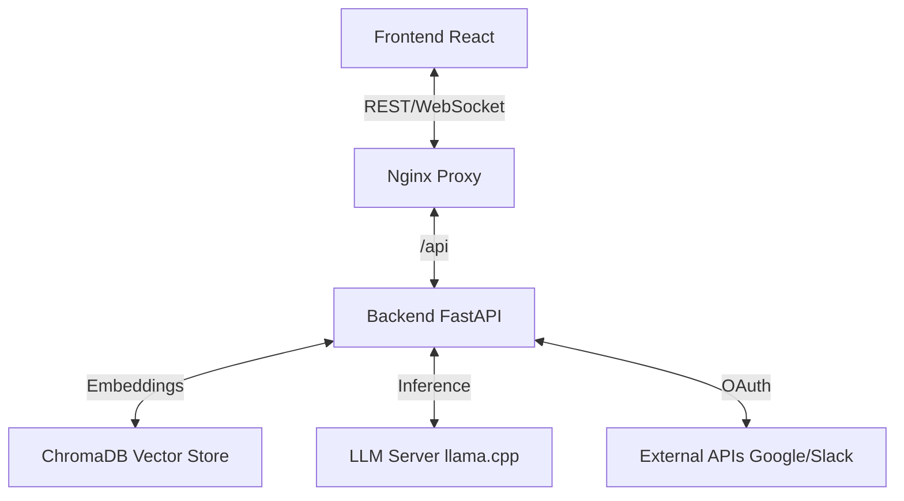

# System Architecture & Design Decisions

This document details the technical architecture, design choices, and optimization strategies used in the AI Knowledge Console.

## 1. High-Level Architecture

The application follows a **microservices-lite** architecture, containerized with Docker for consistency across environments.



### Components

| Component | Technology | Purpose |
|-----------|------------|---------|
| **Frontend** | React + Vite | User interface for chat and document management. |
| **Backend** | FastAPI (Python) | API orchestration, RAG logic, and tool integration. |
| **Vector DB** | ChromaDB | Stores document embeddings for semantic search. |
| **Proxy** | Nginx | Reverse proxy to serve frontend and route API requests. |
| **LLM** | llama.cpp | Local LLM inference server (OpenAI compatible). |

---

## 2. Docker Optimization Strategy

### The "CPU-First" Decision

A critical design choice was made to optimize the Docker images for **CPU inference**.

#### The Problem: PyTorch Bloat
By default, installing `sentence-transformers` or `torch` pulls the **CUDA-enabled version** of PyTorch.
- **Size**: ~2.5 GB (includes massive NVIDIA driver binaries)
- **Impact**: Slow builds, huge images, CI/CD timeouts.
- **Relevance**: Most users run this app on laptops (Mac M1/M2, Intel) or standard cloud VMs without dedicated GPUs.

#### The Solution: Explicit CPU Builds
We explicitly target the CPU-only wheels in our `Dockerfile`:

```dockerfile
# Install CPU-only torch to save ~2GB of space
RUN pip install --no-cache-dir torch --index-url https://download.pytorch.org/whl/cpu
```

**Benefits:**
- **Image Size**: Reduced by ~2GB.
- **Build Speed**: CI builds complete in minutes instead of timing out.
- **Compatibility**: Runs natively on any x86_64 or ARM64 (Apple Silicon) machine.

---

## 3. GPU Enablement Guide

If you **do** have a dedicated NVIDIA GPU and want to accelerate embedding generation, you can build a GPU-enabled version.

### Prerequisites
- NVIDIA GPU with updated drivers
- [NVIDIA Container Toolkit](https://docs.nvidia.com/datacenter/cloud-native/container-toolkit/install-guide.html) installed on host

### How to Enable GPU Support

1. **Modify `docker/backend.Dockerfile`**:
   Remove the CPU-only installation line.

   ```dockerfile
   # REMOVE THIS LINE:
   # RUN pip install --no-cache-dir torch --index-url https://download.pytorch.org/whl/cpu
   
   # The standard requirements.txt install will now pull the CUDA version automatically
   RUN pip install -r requirements.txt
   ```

2. **Update `docker-compose.yml`**:
   Add the `deploy` section to the backend service to pass the GPU through.

   ```yaml
   services:
     backend:
       # ... other config ...
       deploy:
         resources:
           reservations:
             devices:
               - driver: nvidia
                 count: 1
                 capabilities: [gpu]
   ```

3. **Rebuild**:
   ```bash
   docker compose build backend
   docker compose up -d
   ```

---

## 4. Design Patterns

### Factory Pattern (OAuth)
Used in `backend/services/auth/oauth_manager.py` to handle multiple OAuth providers (Google, Slack, Notion) with a unified interface. This makes adding new providers easy without changing the core logic.

### RAG Pipeline
1. **Ingestion**: Documents are chunked (recursive character splitter) and embedded.
2. **Retrieval**: User query is embedded -> Vector search finds top-k relevant chunks.
3. **Augmentation**: Chunks are formatted into a prompt context.
4. **Generation**: LLM generates answer based *only* on the provided context.

### WebSocket Streaming
Chat responses are streamed via WebSockets (`/api/chat/ws`) to provide a real-time "typing" effect, improving perceived latency for the user.
